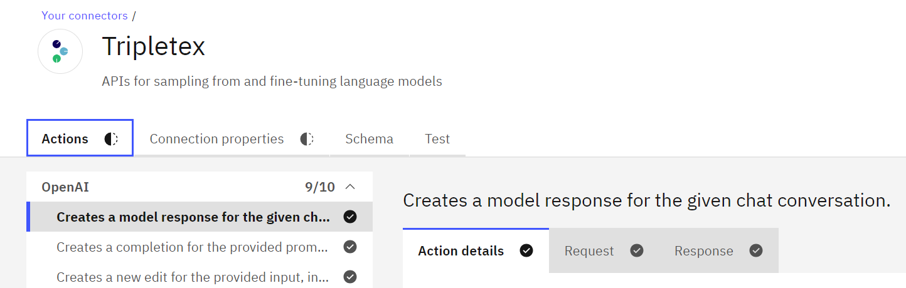

# Connectors using IBM CDK

## Summary

This document describes step-by-step how to create a new smart connector in IBM Automation Explorer using OpenAPI definitions provided by Tripletex.

## Steps

1. Go to the [Tripletex developer portal](https://developer.tripletex.no/) and look for [Tripletex Open API Definition](https://tripletex.no/v2-docs/). This definition file will be used to automatically setup APIs in Connector upon creation. Without this, we will have to manually create each API and its schemas.
2. Note that this file is very large and editors like VS Code or [Swagger](https://editor.swagger.io) may take a while in rendering it, or even crash. This file may fail some strict Open API validations and hence be not importable while creating connector, so we need to fix that before import can proceed.
3. I have used VS Code and OpenAPI Editor extension to edit and lint [Open API Swagger JSON file](https://tripletex.no/v2/swagger.json). Notice the problems being highlighted at the bottom of this image. 
    
4. Once all the linting errors are fixed, log in the [IBM Automation Explorer](https://explorer.automation.ibm.com).    
    
5. After logging in, in the top bar, you will see:
    1. Your account on the top right hand side.
    2. Discover option on left side: This allows us to explore available smart connectors.
    3. **Connector Development Toolkit** next to Discover: This is a toolkit which allows easy creation of new smart connector. This is what we want to work with in this document.
    
6. Go to Connector Development Kit, where you will see all the connectors you have already made and also have the option to **Create a Connector**.
    
7. After clicking on it, you will see this screen.     
    
8. It will open a dialog box asking for the details like “Application Name” you can write the Name of you connector that you are making. For example, “Tripletex” if you are making connector for that.    
    
9. You can leave the second option “Description” for now. As it gets filled by itself when you “Drag and Drop” the Open API Document of the application. For instance, in this case you can import the Open API Documentation file of “Tripletex”.
    1. After importing the file you will see that the second option “Description” is now filled.
    
10. Last option is to import the image of the application.
    - **Optional: How to find suitable logo**
        1.  You can google search “svg image of Tripletex”. As the required format for the image is “.svg”. This can be the logo of the application. In this case the logo of “Tripletex”.
        2. You will see the first link having the  logos of tripletex in various formats. 
            
        3. Go on the second symbol as it is in the SVG format. Click, download it and save it in your computer.
            
        4. After downloading it. Go back to the IBM Automation Explorer page and click on the third option. You will see the edit option on the right hand side. Click on it select the SVG format of Tripletex logo that you just downloaded and upload it here. 
            
        5. After importing the logo. You can now see the logo beside the option.
            
11. Click the option “Create Connector“ to complete importing. You will see your connector is now created. 
    
12. After the connector is created you can now see all the APIs are already available on the left hand side of the screen. 
    
13. Here the red “Display name” shows that there is an error in the name. So, there can two types of errors:
    1. If there is any special character like period (.) so in this case remove this type of special characters for removing this error.
    2. Second type of character is the large string length. The display name can have only 50 characters, so try to limit the number of characters within it.
    Note: Even a blank space between words is counted as a character.    
14. Here you see the Actions option the black partial dotted circle indicates that all the actions are not completed. Wherever you find this type of circle it indicates the action is incomplete. And wherever you find a full black circle it shows the task is completed and has a tick inside the circle. In “Actions” you will find all the APIs that you have imported during  the creation of smart connector.
    
15. We have two ways of editing “Actions” and “Action Groups“:
    1. **Add or remove actions**: To create new Action (or, API) or add/remove available Actions from list of Connector Action. click “Add or remove actions”. Click on “Apply Changes” to save and apply those changes to your Actions.
        
    2. **Add or edit groups:** Now, to create groups for these actions, click on the “Add or edit groups”**.** This is important when you have multiple APIs related to one functionality, makes it easier to manage them in groups. You can set Groups on individual Actions.
        
16. In the next option **Connection Properties,** you can the add the authorization type that you want in your connector like “Basic”, “API Key” etc. Tick in the box and it will be added.
    
    For instance, I have clicked on the Basic authorization types. You will see a new box requiring the Username and Password that you would like to authorize. Similarly whatever type of authorization you choose you can add the credentials accordingly.
    
17. In the next option **Schema,** you will see all the schemas available you can create any new parameter or delete any schema that you do not need.
    
18. Once you have set the schema now you can choose the **Test** option when all your APIs are ready and all the errors have been debugged now you can Test your connector. If it gives 200 response code it means your test is passed if it gives any other error codes then start to debug.